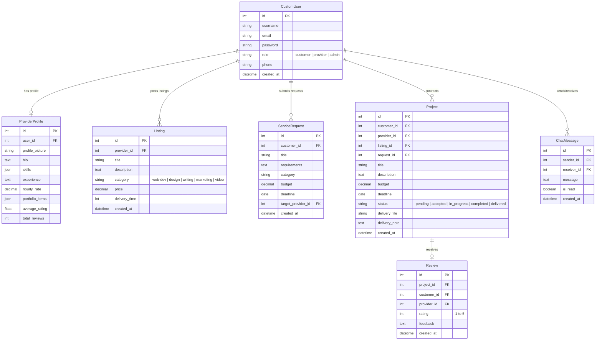

# Teyzix Core Multi-Vendor Service Marketplace Platform

A comprehensive service marketplace platform simulating real-world portals like Fiverr and Upwork. Customers can post open project requests or browse listed services to hire providers directly, track active contract milestones through a visual status pipeline, chat with freelancers in real-time, submit reviews, and view key metrics via role-based dashboard screens.

---

## 🚀 Key Features
1. **Role-Based Authentication & Profiles**: Separate portal experiences and dashboards for **Customers**, **Service Providers (Freelancers)**, and **Administrators** powered by Django Custom Users and JWT tokens.
2. **Dynamic Service Listings Directory**: Service providers can CRUD listings (Web Dev, Graphics & Design, Content Writing, etc.). Features instant search, category filtering, and sorting.
3. **Open Request System**: Customers can post job requirements, budgets, and deadlines to a public job feed where freelancers can review and apply directly.
4. **Milestone Project Tracker**: Interactive visual workflow timeline (Pending ➔ Accepted ➔ In Progress ➔ Completed ➔ Delivered) tracking deliverables, file attachments, and completion actions.
5. **Rating & Feedback Board**: Automated rating averaging that computes provider profiles' cumulative scores based on client project feedback.
6. **Simulated Real-Time Chat**: Direct messaging workspace between clients and freelancers featuring automated scrolling, unread badge counters, and rapid polling intervals.
7. **Premium Aesthetics (Dark Mode & Micro-Animations)**: Custom theme layout featuring full dark mode compliance, outfit/inter Google typography, glowing buttons, and responsive layout.

---

## 🛠️ Technology Stack
* **Frontend**: React.js, Tailwind CSS v4, React Router, Axios, Lucide Icons.
* **Backend**: Python, Django REST Framework, Django REST SimpleJWT, Pillow.
* **Database**: SQLite (Primary storage for transactional stability on Python 3.13) + PyMongo connector layouts.

---

## 📊 Database Schema Design

The relational database is designed around a Custom User model supporting roles, extending provider details with a One-to-One profile table, and connecting transactions through foreign keys:



---

## 📡 API Endpoints Documentation

All endpoints require standard JSON payloads. Protected endpoints require a valid JWT bearer token.

### 🔑 Authentication & Profiles
* `POST /api/users/register/` - Create a new user account (Customer/Provider).
* `POST /api/users/login/` - Retrieve JWT access & refresh token.
* `POST /api/users/login/refresh/` - Refresh JWT access token.
* `GET /api/users/profile/` - Fetch current user's profile information.
* `PATCH /api/users/profile/` - Update email, phone, and provider details (bio, skills, hourly rate, portfolio).
* `POST /api/users/profile/avatar/` - Upload profile image file.
* `GET /api/users/providers/` - List all service providers with filters.
* `GET /api/users/providers/<id>/` - Retrieve detailed provider profile and skills.

### 📦 Service Catalog Listings
* `GET /api/listings/` - Browse services (supports search `?search=keyword` and filters `?category=web-dev`).
* `POST /api/listings/` - Create a listing (Providers only).
* `PUT/PATCH/DELETE /api/listings/<id>/` - Manage a specific listing (Listing owner only).

### 📝 Open Requests Feed
* `GET /api/requests/` - Browse open customer service requests.
* `POST /api/requests/` - Submit a new open service request (Customers only).
* `PUT/PATCH/DELETE /api/requests/<id>/` - Manage a request (Creator only).

### 📁 Project Tracking & Milestones
* `GET /api/projects/` - List all projects current user is hired for / hired.
* `POST /api/projects/` - Hire a provider (starts a pending project contract).
* `POST /api/projects/<id>/accept/` - Accept a project contract (Providers only).
* `POST /api/projects/<id>/start/` - Mark project as started and In Progress (Providers only).
* `POST /api/projects/<id>/complete/` - Submit deliverables (uploads zip/pdf file + notes) (Providers only).
* `POST /api/projects/<id>/deliver/` - Approve delivery and finalize project (Customers only).

### 💬 Inbox Chat
* `GET /api/chat/conversations/` - List current active chat channels and unread counts.
* `GET /api/chat/messages/<user_id>/` - Fetch message history between current user and selection.
* `POST /api/chat/messages/send/` - Send a text message to a user.

### 📊 Dashboard Stats
* `GET /api/users/dashboard/` - Fetch role-based diagnostic statistics (spent volume, earnings, user counts).

---

## ⚙️ Getting Started & Local Setup

### 1. Backend Setup (Django)
1. Open terminal and navigate to backend directory:
   ```bash
   cd backend
   ```
2. Activate python virtual environment:
   * **Windows Powershell**:
     ```powershell
     .\venv\Scripts\Activate.ps1
     ```
   * **macOS / Linux**:
     ```bash
     source venv/bin/activate
     ```
3. Apply database migrations:
   ```bash
   python manage.py migrate
   ```
4. **Hydrate database with demo catalog data (Users, Listings, Projects, Reviews)**:
   ```bash
   python manage.py seed_db
   ```
5. Run the server:
   ```bash
   python manage.py runserver
   ```
   *The backend REST API is hosted at `http://127.0.0.1:8000/`.*

### 2. Frontend Setup (React.js)
1. Open a new terminal and navigate to the frontend directory:
   ```bash
   cd frontend
   ```
2. Install packages:
   ```bash
   npm install
   ```
3. Start the Vite server:
   ```bash
   npm run dev
   ```
   *The client will start at `http://localhost:5173/`.*

---

## 🔑 Test Login Credentials (Created by Seeder)

Use these accounts to instantly explore the marketplace:

| Role | Username | Password | Purpose |
| :--- | :--- | :--- | :--- |
| **Admin** | `admin_root` | `adminpassword123` | Inspect global transaction volumes and platform diagnostic stats. |
| **Customer** | `alex_customer` | `password123` | Browse catalog, order listings, manage contracts, approve delivery. |
| **Customer** | `sarah_customer` | `password123` | Submit service requests, chat with freelancers. |
| **Service Provider** | `dev_developer` | `password123` | Web dev freelancer (Django, React). Accept orders, start work, deliver code. |
| **Service Provider** | `design_creative` | `password123` | UI/UX designer. Edit skills list, manage portfolio items. |
